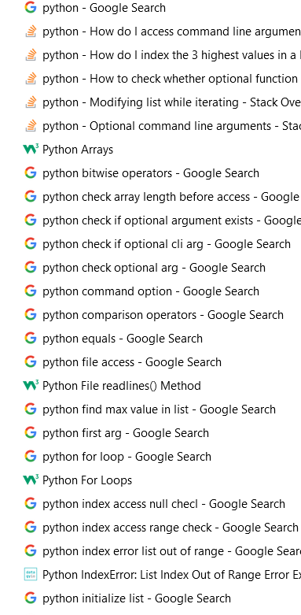

# Advent of Code 2022

This year I'm trying to brush up on my Python skills, which have not been touched since my degree project in 2017.

## Day 01

Simple problem, but my memories of Python have gone. I am flipping to Google every 2 minutes or so to search for _literally. everything_. A snapshot:

## Day 02

Having hell with this one. I didn't expect to need to learn to unit test in Python so soon but here we are. It's for the best.

I'm using [pytest](https://docs.pytest.org/en/7.2.x/) and the documentation font is _Garamond_. 😧 My eyes!

After implementing the test for `scoreForRound` it was immediately obvious that my `and not (opponent_score == 1 and my_score == 3)` clause wasn't executing as expected. I needed an extra set of brackets. 🤦🏻‍♀️

That was painful. Lessons learned:
- unit testing speeds up debugging
- when in doubt, use extra brackets for complex conditionals